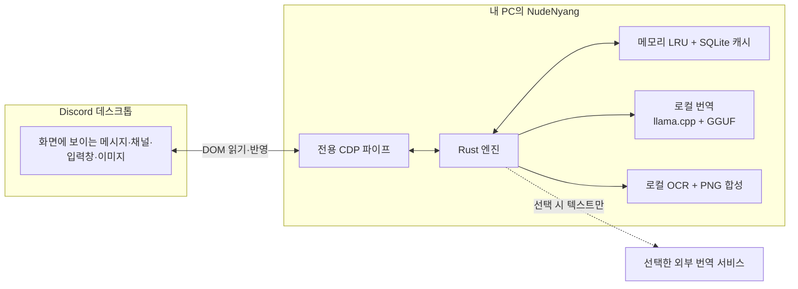
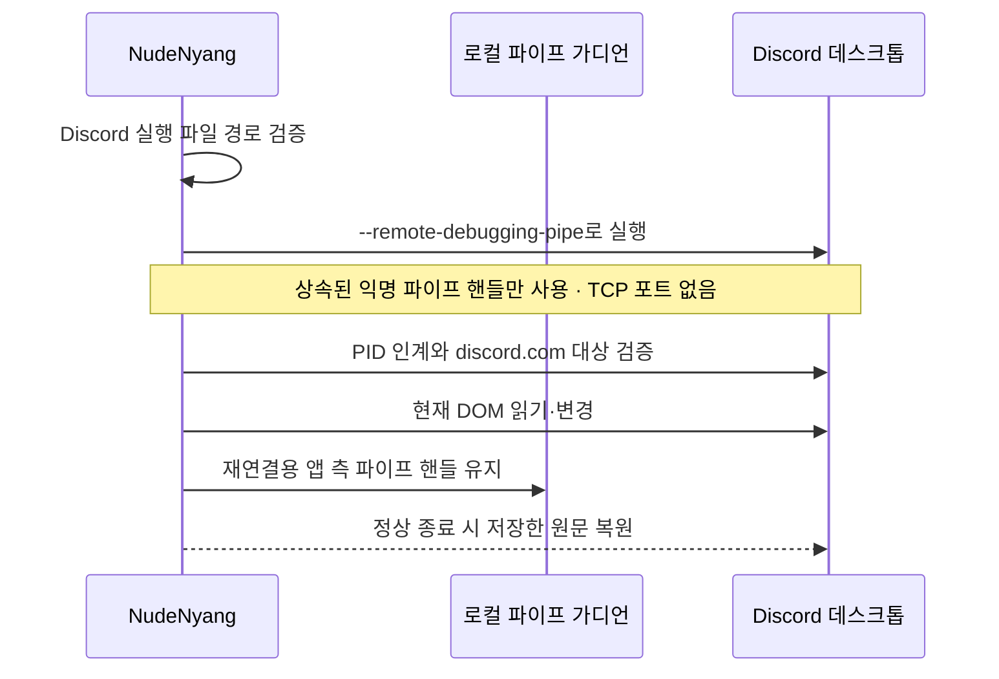

<p align="center">
  
</p>

<h1 align="center">NudeNyang Discord Translator</h1>

<p align="center">평소 쓰던 Discord 창에서 메시지, 채널명, 보내는 글과 이미지까지 번역합니다.</p>

<p align="center"><a href="README.md">English</a> · <strong>한국어</strong></p>

<p align="center">
  <a href="https://nudenyang.github.io/NudeNyang-Discord-Translator/"><strong>공식 웹사이트</strong></a>
</p>

<p align="center">
  
  
  
  
  
</p>

NudeNyang은 화면에 떠 있는 Discord 창과 직접 연결되는 Tauri/Rust 앱입니다. Discord 사용자 토큰이나 비공식 API, self-bot은 쓰지 않습니다. 전용 CDP 파이프로 현재 렌더러를 읽고, 화면에 그려진 DOM만 바꿉니다. 번역을 끄면 보관해 둔 원문으로 돌아갑니다.

> [!IMPORTANT]
> 이 프로그램은 비공식 베타입니다. Discord가 지원하는 클라이언트 확장 방식이 아니므로 업데이트 뒤에 동작이 깨질 수 있고 정책상 위험도 있습니다. 실시간 번역은 사용자가 이 내용을 확인하고 동의하기 전에는 켜지지 않습니다.

## 오픈 베타 다운로드

[GitHub Releases](https://github.com/NudeNyang/NudeNyang-Discord-Translator/releases)에서 Windows 10/11 x64 설치 파일을 받을 수 있습니다. 오픈 베타는 완성된 정식판이 아니므로 중요한 대화에서는 번역 결과를 원문과 함께 확인해 주세요.

## 동작 화면

https://github.com/user-attachments/assets/ca870b61-7b9c-489c-af42-ae66805f6bd5

<p align="center">
  <a href="https://github.com/NudeNyang/NudeNyang-Discord-Translator/raw/refs/heads/main/landing/assets/full-discord-translation-demo.mp4">전체 시연 · MP4 · 41.3 MB</a>
</p>

## 동작 원리



WebView는 설정창과 트레이를 그리는 데만 씁니다. 프로세스 제어, 번역, 언어 판별, 캐시, OCR, Discord 연동은 Rust 코어가 맡습니다.

번역은 대상에 따라 다음 세 경로로 나뉩니다.

| 대상 | 처리 방식 |
|---|---|
| 받은 글 | 화면에 보이는 메시지와 채널명을 판별해 번역하고 현재 DOM에 반영합니다. 되돌릴 수 있도록 원문 노드는 따로 보관합니다. |
| 보내는 글 | Enter나 지정한 단축키를 누를 때 입력창의 글을 번역합니다. 결과가 UTF-16 기준 1,900단위를 넘으면 여러 메시지로 쪼개지 않고 UTF-8 텍스트 파일 하나로 첨부합니다. |
| 이미지 | 이미지를 PC 안에서 읽고 PP-OCR로 문자를 찾습니다. 번역문을 새 PNG로 합성한 뒤 화면에 표시되는 이미지 주소만 바꿉니다. 원본과 번역본은 언제든 다시 전환할 수 있습니다. |

## 보안 구조



연결 범위는 필요한 만큼으로만 좁혀 두었습니다.

| 구분 | NudeNyang의 처리 방식 |
|---|---|
| Discord 계정 | 사용자 토큰을 읽지 않으며, 사용자 계정으로 Discord API를 호출하지 않습니다. |
| 연결 | 상속된 익명 파이프 핸들만 사용합니다. TCP 디버깅 포트는 열지 않습니다. |
| 프로세스 검증 | 정규화된 실행 파일 경로, 최초 프로세스, 같은 설치 경로의 PID 인계, 가디언 인수, `https://discord.com` 페이지를 확인합니다. |
| 클라이언트 변경 | 현재 렌더러만 바꿉니다. Discord 설치 파일이나 서버 데이터는 수정하지 않습니다. |
| 외부 번역 | 외부 서비스를 고른 경우 번역할 텍스트만 전달합니다. 이미지 픽셀, 인증 토큰, 캐시 DB는 PC 밖으로 보내지 않습니다. |
| 인증 정보 | DeepL 키는 설정 JSON, 로그, 캐시가 아닌 Windows 자격 증명 관리자에 저장합니다. 구독 서비스는 각 공급자의 공식 로컬 CLI 인증을 따릅니다. |
| 진단 로그 | 사용자 홈 경로와 비밀 값은 가리고, 메시지 본문과 로컬 모델 프롬프트는 남기지 않습니다. |
| 모델 다운로드 | 고정된 리비전에서 받은 뒤 예상 크기와 SHA-256이 맞는 파일만 불러옵니다. |

Hy-MT2와 TranslateGemma는 PC 안에서 처리됩니다. ChatGPT, Claude, Gemini, DeepL은 선택 사항이며, 이 가운데 하나를 고르면 번역할 텍스트가 해당 서비스로 전송됩니다.

## 주요 기능

- 보수적인 언어 판별을 적용한 받은 메시지·채널명 번역
- 채널별 설정이나 최근 대화 언어를 따르는 보내는 메시지 번역
- 한국어, 영어, 일본어, 간체·번체 중국어를 포함한 채팅·인터페이스 28개 언어
- Hy-MT2 1.8B·7B 로컬 모델과 실험용 TranslateGemma 4B
- 선택형 ChatGPT·Claude·Gemini·DeepL 연동과 테스트용 Mock 엔진
- 적응형 PP-OCR 인식, 원본/번역 전환을 갖춘 로컬 이미지 번역
- 엔진·언어·프롬프트·말투·렌더러 버전별 메모리 및 SQLite 캐시
- GPU 가속을 쓸 수 없을 때 메모리 점유를 줄인 CPU 모드로 자동 전환
- 전역 단축키, 트레이 상태 동기화, 설정창 단일 인스턴스
- GitHub Releases를 통한 서명된 오픈 베타 업데이트

전체 언어 목록과 공급자별 안내는 [docs/LANGUAGES.md](docs/LANGUAGES.md)에서 볼 수 있습니다.

## 지원 환경

| 운영체제 | 상태 |
|---|---|
| Windows 10/11 x64 | 현재 개발·배포 대상 |
| macOS Apple Silicon | Rust 공통 코어와 자원 경로만 준비, 아직 미지원 |
| macOS Intel | 계획 없음 |

## 개발 실행

Rust stable, Node.js/npm, Windows WebView2 빌드 환경이 필요합니다.

```powershell
npm install
powershell -ExecutionPolicy Bypass -File scripts/setup_hymt_runtime.ps1
npm run tauri:dev
```

저장소 검사는 아래 명령으로 실행합니다.

```powershell
npm test
npm run test:locales
cd src-tauri
cargo test --no-fail-fast
cargo clippy --bin nude-translator-tauri -- -D warnings
cargo build --release
```

<details>
<summary>Windows 패키징과 오픈 베타 배포</summary>

일반 ZIP에는 Tauri/Rust 앱, llama.cpp, Microsoft Visual C++ 앱 로컬 런타임, Hy-MT2 1.8B가 들어갑니다. 7B 모델까지 묶으려면 `-IncludeLargeModel`을 추가합니다.

```powershell
powershell -ExecutionPolicy Bypass -File scripts/package.ps1 -Clean
```

오픈 베타는 Tauri 업데이트 서명을 적용한 NSIS 설치 파일과 GitHub Releases를 사용합니다. 업데이트 서명은 설치 파일의 무결성을 검증하지만 Microsoft Authenticode 코드 서명과는 별개입니다. 업데이트 서명 키는 저장소가 아닌 `%LOCALAPPDATA%\NudeNyang Discord Translator\secrets`에 보관합니다. 0.5.14는 기존 비공개 베타 설치본을 공개 GitHub 업데이트 채널로 옮기는 일회성 Cloudflare R2 연결 버전입니다.

```powershell
powershell -ExecutionPolicy Bypass -File scripts/package_github_release.ps1
powershell -ExecutionPolicy Bypass -File scripts/deploy_github_release.ps1
```

</details>

## 문서

| 문서 | 내용 |
|---|---|
| [docs/ARCHITECTURE.md](docs/ARCHITECTURE.md) | 런타임 구성, Discord 연결, 데이터 경계, OCR, 플랫폼 분리 |
| [docs/LANGUAGES.md](docs/LANGUAGES.md) | 28개 언어, 감지 방식, 공급자 지원 범위, OCR 범위 |
| [THIRD_PARTY_NOTICES.md](THIRD_PARTY_NOTICES.md) | 모델, 런타임, 의존성 고지 |

## 라이선스

Copyright (C) 2026 NudeNyang

앱 소스는 GNU GPL version 3 전용(`GPL-3.0-only`)으로 배포합니다. Hy-MT2, llama.cpp, OCR 모델과 번들 런타임에는 각 구성요소의 라이선스가 적용됩니다. 자세한 내용은 [LICENSE](LICENSE), [THIRD_PARTY_NOTICES.md](THIRD_PARTY_NOTICES.md), [licenses](licenses)에서 확인할 수 있습니다.

Discord는 Discord Inc.의 상표입니다. NudeNyang Discord Translator는 Discord Inc.와 제휴하거나 승인을 받은 제품이 아닙니다.
