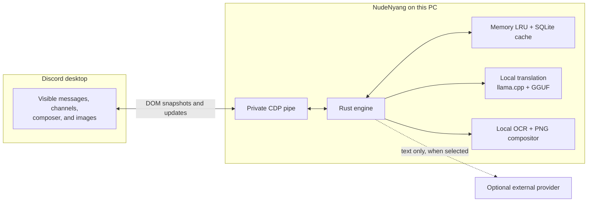

<p align="center">
  
</p>

<h1 align="center">NudeNyang Discord Translator</h1>

<p align="center">
  Translate messages, channel names, outgoing text, and images inside the Discord desktop window.
</p>

<p align="center">
  <strong>English</strong> · <a href="README.ko.md">한국어</a>
</p>

<p align="center">
  
  
  
  
  
</p>

NudeNyang works with the Discord window that is already on screen. It does not use a Discord user token, an unofficial Discord API, or a self-bot. A Tauri/Rust app reads the current renderer through a private CDP pipe and replaces only the rendered DOM. Turning translation off restores the saved original content.

> [!IMPORTANT]
> This is an unofficial beta. Discord does not provide a supported client-extension API for this integration, so a Discord update can break it and using it may carry policy risk. Live translation stays off until the user accepts that notice.

## See it in action

https://github.com/user-attachments/assets/ca870b61-7b9c-489c-af42-ae66805f6bd5

<p align="center">
  <a href="landing/assets/full-discord-translation-demo.mp4?raw=1">Full demo · MP4 · 41.3 MB</a>
</p>

## How it works



The WebView is limited to settings and tray rendering. Process control, translation, language detection, caching, OCR, and Discord integration live in the Rust core.

There are three translation paths:

| Path | What happens |
|---|---|
| Incoming text | Visible messages and channel names are detected, translated, and replaced in the current DOM. The original nodes are kept for restoration. |
| Outgoing text | Enter or a configured shortcut translates the composer text before sending. Results over 1,900 UTF-16 units are attached as one UTF-8 text file instead of being split into message spam. |
| Images | Rust reads the image locally, runs PP-OCR, translates the extracted text, creates a replacement PNG, and swaps only the displayed image source. Original and translated views remain switchable. |

## Security boundary

```mermaid
sequenceDiagram
    participant App as NudeNyang
    participant Guard as Local pipe guardian
    participant Discord as Discord desktop

    App->>App: Verify the Discord executable path
    App->>Discord: Start with --remote-debugging-pipe
    Note over App,Discord: Inherited anonymous pipe handles only; no TCP debug port
    App->>Discord: Verify PID handoff and the discord.com target
    App->>Discord: Read and update the rendered DOM
    App->>Guard: Leave app-side pipe handles for reconnect
    App-->>Discord: Restore saved DOM on normal shutdown
```

The boundary is intentionally narrow:

| Area | What NudeNyang does |
|---|---|
| Discord identity | Does not read a user token and does not call Discord as a user account. |
| Connection | Uses inherited anonymous pipe handles. It does not open a TCP debugging port. |
| Process trust | Checks the normalized executable path, the original process, a same-install PID handoff, guardian arguments, and an `https://discord.com` page target. |
| Client changes | Changes the current renderer only. It does not patch Discord installation files or write server-side data. |
| External translation | Sends extracted text only when an external provider is selected. Image pixels, authentication tokens, and the cache database stay local. |
| Credentials | Stores the DeepL key in Windows Credential Manager, not in settings JSON, logs, or the translation cache. Subscription connections use each provider's official local CLI authentication. |
| Diagnostics | Redacts home paths and secrets. Message bodies and local-model prompts are not written to the log. |
| Downloaded models | Uses pinned revisions and verifies expected file size and SHA-256 before loading. |

Local Hy-MT2 and TranslateGemma requests stay on the machine. ChatGPT, Claude, Gemini, and DeepL are optional; choosing one sends the text that needs translation to that provider under its own terms.

## Features

- Incoming-message and channel-name translation with conservative language detection
- Outgoing translation based on a per-channel choice or recent conversation language
- 28 chat and interface languages, including Korean, English, Japanese, Simplified and Traditional Chinese
- Hy-MT2 1.8B and 7B local models, plus experimental TranslateGemma 4B
- Optional ChatGPT, Claude, Gemini, DeepL, and a mock provider for testing
- Local image translation with adaptive PP-OCR recognition and original/translated toggling
- Memory and SQLite caching separated by engine, language, prompt, register, and renderer version
- Automatic GPU fallback to a RAM-conscious CPU mode when acceleration is unavailable
- Configurable global shortcuts, synchronized tray state, and a single settings window
- Signed private-beta updates distributed through Cloudflare R2

The complete language catalog and provider notes are in [docs/LANGUAGES.md](docs/LANGUAGES.md).

## Platform status

| Platform | Status |
|---|---|
| Windows 10/11 x64 | Current development and distribution target |
| macOS Apple Silicon | Shared Rust core and resource layout prepared; not supported yet |
| macOS Intel | Not planned |

## Development

You need Rust stable, Node.js/npm, and a Windows WebView2 build environment.

```powershell
npm install
powershell -ExecutionPolicy Bypass -File scripts/setup_hymt_runtime.ps1
npm run tauri:dev
```

Run the repository checks with:

```powershell
npm test
npm run test:locales
cd src-tauri
cargo test --no-fail-fast
cargo clippy --bin nude-translator-tauri -- -D warnings
cargo build --release
```

<details>
<summary>Windows packaging and private-beta deployment</summary>

The normal ZIP contains the Tauri/Rust app, llama.cpp, the Microsoft Visual C++ app-local runtime, and Hy-MT2 1.8B. Add `-IncludeLargeModel` to package the 7B model as well.

```powershell
powershell -ExecutionPolicy Bypass -File scripts/package.ps1 -Clean
```

Private beta builds use a signed NSIS installer and Cloudflare R2. Signing keys, beta tokens, and invite links stay outside the repository under `%LOCALAPPDATA%\NudeNyang Discord Translator\secrets`.

```powershell
powershell -ExecutionPolicy Bypass -File scripts/setup_beta_r2.ps1
powershell -ExecutionPolicy Bypass -File scripts/package_beta.ps1
powershell -ExecutionPolicy Bypass -File scripts/deploy_beta_release.ps1
```

</details>

## Documentation

| Document | Contents |
|---|---|
| [docs/ARCHITECTURE.md](docs/ARCHITECTURE.md) | Runtime ownership, Discord connection, data boundaries, OCR, and platform separation |
| [docs/LANGUAGES.md](docs/LANGUAGES.md) | The 28-language catalog, detection behavior, provider coverage, and OCR scope |
| [THIRD_PARTY_NOTICES.md](THIRD_PARTY_NOTICES.md) | Model, runtime, and dependency notices |

## License

Copyright (C) 2026 NudeNyang

The application source is licensed under GNU GPL version 3 only (`GPL-3.0-only`). Hy-MT2, llama.cpp, OCR models, and bundled runtimes keep their own licenses. See [LICENSE](LICENSE), [THIRD_PARTY_NOTICES.md](THIRD_PARTY_NOTICES.md), and [licenses](licenses).

Discord is a trademark of Discord Inc. NudeNyang Discord Translator is not affiliated with or endorsed by Discord Inc.
