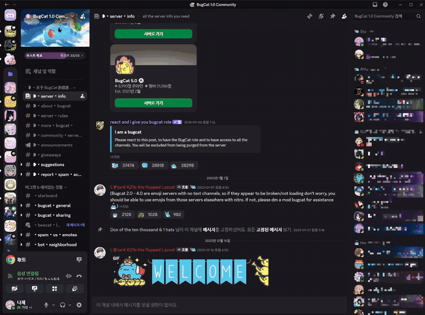
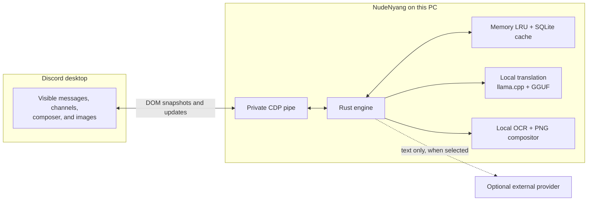
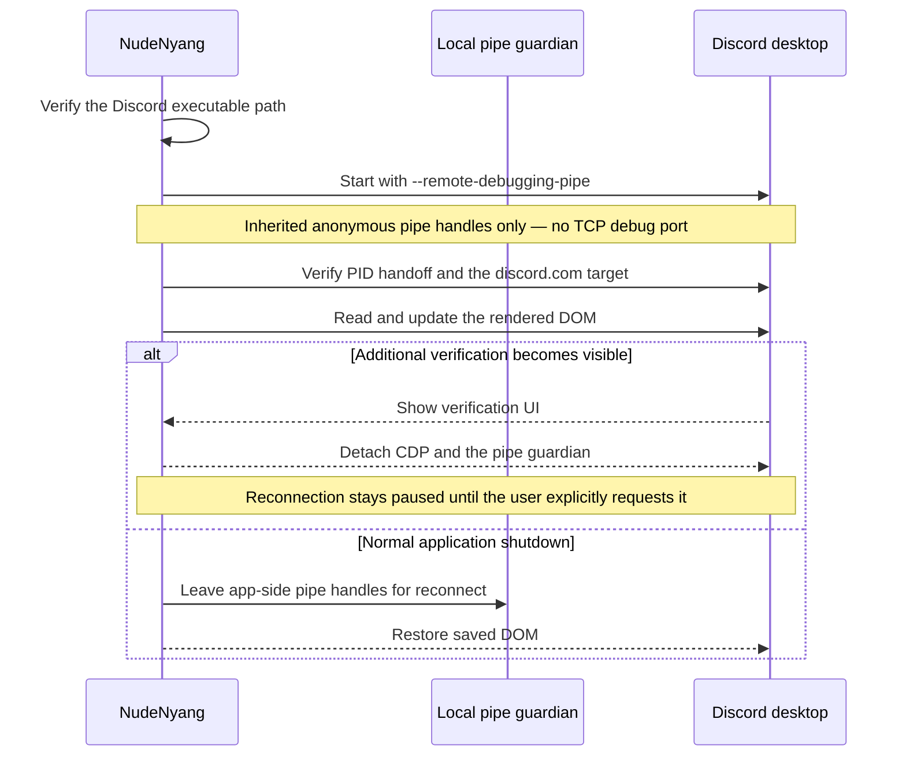

<p align="center">
  
</p>

<h1 align="center">NudeNyang Discord Translator</h1>

<p align="center">
  Translate messages, channel names, outgoing text, and images inside the Discord desktop window.
</p>

<p align="center">
  <strong>English</strong> · <a href="README.ko.md">한국어</a>
</p>

<p align="center">
  <a href="https://nudenyang.github.io/NudeNyang-Discord-Translator/"><strong>Official website</strong></a>
</p>

<p align="center">If you'd like to support the project, an optional supporter edition is available on <a href="https://nudenyang.booth.pm/items/8726877">BOOTH</a>.</p>

<p align="center">
  
  
  
  
  
</p>

NudeNyang works with the Discord window that is already on screen. It does not use a Discord user token, an unofficial Discord API, or a self-bot. A Tauri/Rust app reads the current renderer through a private CDP pipe and replaces only the rendered DOM. Turning translation off restores the saved original content. Optional Chrome, Naver Whale, and Firefox extensions use the same Windows translation engine for supported web pages while preserving their text-node layout.

> [!IMPORTANT]
> This is an unofficial beta. A Discord update can change the renderer and temporarily break translation. When Discord shows additional verification, verification compatibility mode pauses the translation connection until the user completes verification and explicitly reconnects NudeNyang.

## Download the Open Beta

Download the current Windows installer from [GitHub Releases](https://github.com/NudeNyang/NudeNyang-Discord-Translator/releases). This is an open beta rather than a finished stable release, so verify important translations against the original text.

- `x64` is for most Intel and AMD Windows PCs; `ARM64` is for Windows on ARM.
- Public releases provide x64 and ARM64 installers only. Portable packages are no longer distributed because they do not support automatic updates.
- The updater `.sig` accompanies the x64 Setup used by automatic updates. Windows installer checksums are listed in `SHA256SUMS.txt`.

## See it in action

### Quick demo



### Full demo

https://github.com/user-attachments/assets/7b6a5900-8ebb-4d89-8466-e7c077826714

## How it works



The WebView is limited to settings and tray rendering. Process control, translation, language detection, caching, OCR, and Discord integration live in the Rust core.

There are three translation paths:

| Path | What happens |
|---|---|
| Incoming text | Visible messages, nicknames, and channel names are detected, translated, and replaced in the current DOM. Nickname translation is enabled by default, and the original nodes are kept for restoration. |
| Outgoing text | Drafts already in the selected target language, symbol-only text, and kaomoji pass through the first physical Enter unchanged. Other drafts are translated and left editable; a second physical Enter is passed untouched to Discord, so only the user sends the message. Long results remain in the composer for manual shortening or attachment. |
| Images | Rust reads the image locally, runs PP-OCR, translates the extracted text, creates a replacement PNG, and swaps only the displayed image source. Original and translated views remain switchable. |

## Security boundary



The boundary is intentionally narrow:

| Area | What NudeNyang does |
|---|---|
| Discord identity | Does not read a user token and does not call Discord as a user account. |
| Connection | Uses inherited anonymous pipe handles. It does not open a TCP debugging port. |
| Process trust | Checks the normalized executable path, the original process, a same-install PID handoff, guardian arguments, and official Stable, PTB, or Canary Discord page targets. |
| Client changes | Changes the current renderer only. It does not patch Discord installation files or write server-side data. |
| Sending | Places translated text with `Input.insertText` only. It does not synthesize Enter, mouse actions, file attachments, or split-message sends. |
| Verification compatibility | Detects visible additional verification, detaches the translation pipe, and offers a standard Discord restart. Reconnection requires an explicit user action. |
| External translation | Sends extracted text only when an external provider is selected. Image pixels, authentication tokens, and the cache database stay local. |
| Credentials | Stores the DeepL key in Windows Credential Manager, not in settings JSON, logs, or the translation cache. Subscription connections use each provider's official local CLI authentication. |
| Diagnostics | Redacts home paths and secrets. Message bodies and local-model prompts are not written to the log. |
| Downloaded models | Uses pinned revisions and verifies expected file size and SHA-256 before loading. |

Local Hy-MT2 and TranslateGemma requests stay on the machine. ChatGPT, Claude, Gemini, and DeepL are optional; choosing one sends the text that needs translation to that provider under its own terms.

## Features

- Incoming-message and channel-name translation with conservative detection and an optional source-language filter
- Outgoing translation based on a per-channel choice or recent conversation language, with the final send left to the user
- 28 chat and interface languages, including Korean, English, Japanese, Simplified and Traditional Chinese
- Hy-MT2 1.8B and 7B local models, plus experimental TranslateGemma 4B
- Optional ChatGPT, Claude, Gemini, DeepL, and a mock provider for testing
- Local image translation with adaptive PP-OCR recognition and original/translated toggling
- Selection dictionary with a separate result window, speech, contextual sense ordering, personal terms, and install-on-demand practical packs
- Verification compatibility mode that pauses translation during additional Discord verification and reconnects only on request
- Optional Chrome, Naver Whale, and Firefox web translation for GitHub, BOOTH, Google Search, YouTube, X, and general HTTP(S) pages
- Paragraph-context translation that changes individual text nodes and restores the exact original page text
- Memory and SQLite caching separated by engine, language, prompt, register, and renderer version
- Automatic GPU fallback to a RAM-conscious CPU mode when acceleration is unavailable
- Configurable global shortcuts, synchronized tray state, and a single settings window
- Signed Open Beta updates distributed through GitHub Releases

The complete language catalog and provider notes are in [docs/LANGUAGES.md](docs/LANGUAGES.md).

## Platform status

| Platform | Status |
|---|---|
| Windows 10/11 x64 | Primary development and distribution target |
| Windows 11 ARM64 | Native local packaging supported; device testing is more limited than x64 |
| macOS Apple Silicon | Shared Rust core and resource layout prepared; not supported yet |
| macOS Intel | Not planned |

Windows x64 and ARM64 installer artifacts can be created locally with:

```powershell
powershell -ExecutionPolicy Bypass -File .\scripts\package_windows_variants.ps1
```

Every Windows release must build, verify, and publish the x64 and ARM64 installers together.
Portable packages are excluded from public releases because they do not support automatic updates.

## Development

You need Rust stable, Node.js/npm, and a Windows WebView2 build environment.

```powershell
npm install
powershell -ExecutionPolicy Bypass -File scripts/setup_hymt_runtime.ps1
npm run tauri:dev
```

Run the repository checks with:

```powershell
npm test
npm run test:locales
cd src-tauri
cargo test --no-fail-fast
cargo clippy --bin nude-translator-tauri -- -D warnings
cargo build --release
```

<details>
<summary>Windows packaging and Open Beta deployment</summary>

Open Beta builds use updater-signed NSIS installers and GitHub Releases. Windows releases build and verify x64 and ARM64 installers together. Portable packages remain excluded because they do not support automatic updates. The updater signing key stays outside the repository under `%LOCALAPPDATA%\NudeNyang Discord Translator\secrets`.

```powershell
powershell -ExecutionPolicy Bypass -File scripts/package_github_release.ps1
powershell -ExecutionPolicy Bypass -File scripts/deploy_github_release.ps1
```

</details>

## Documentation

| Document | Contents |
|---|---|
| [docs/ARCHITECTURE.md](docs/ARCHITECTURE.md) | Runtime ownership, Discord connection, data boundaries, OCR, and platform separation |
| [docs/BROWSER_EXTENSION.md](docs/BROWSER_EXTENSION.md) | Browser prototype installation, supported page areas, privacy boundaries, and test procedure |
| [docs/LANGUAGES.md](docs/LANGUAGES.md) | The 28-language catalog, detection behavior, provider coverage, and OCR scope |
| [docs/DICTIONARY.md](docs/DICTIONARY.md) | Selection lookup, offline packs, personal terms, expansion gates, and data licensing boundaries |
| [PRIVACY.md](PRIVACY.md) | Local data handling and optional external-provider transfers |
| [CODE_SIGNING_POLICY.md](CODE_SIGNING_POLICY.md) | Release provenance, signing roles, and verification policy |
| [THIRD_PARTY_NOTICES.md](THIRD_PARTY_NOTICES.md) | Model, runtime, and dependency notices |
| [docs/releases/0.6.1-beta.md](docs/releases/0.6.1-beta.md) | New features and fixes in 0.6.1 Beta |
| [docs/releases/0.6.0-beta.md](docs/releases/0.6.0-beta.md) | New features and fixes in 0.6.0 Beta |

## License

Copyright (C) 2026 NudeNyang

The application source is licensed under GNU GPL version 3 only (`GPL-3.0-only`). Hy-MT2, llama.cpp, OCR models, and bundled runtimes keep their own licenses. See [LICENSE](LICENSE), [THIRD_PARTY_NOTICES.md](THIRD_PARTY_NOTICES.md), and [licenses](licenses).

Discord is a trademark of Discord Inc. NudeNyang Discord Translator is not affiliated with or endorsed by Discord Inc.
